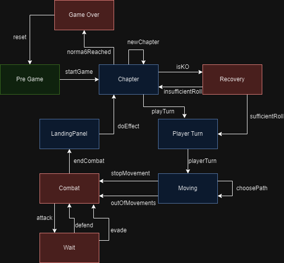

# 99.7% Citric Liquid

## About

`99.7% Citric Liquid` is a simplified clone of the renowned game, `100% Orange Juice`. Its main
purpose is to serve as an educational tool, teaching foundational programming concepts.

📢 **Note**: This project is purely educational and will not be used for any commercial purposes.

---

## Tarea 3 - Juan Ignacio Molina: Specifications

### Model

In the following paragraphs, the implemented functionalities of the main structure of the game are specified, along with the
functionalities of the game's controller.

The project's model is divided on three packages, Panels, Units and Norma, and the Units package has another package WildUnits on it. The Panels 
package contains the constructors for the Panel objects, which are the components of a board on a game. The Units package contains the 
constructors for the Units, which are the Entities that interact in said board. They can be either playable (Therefore dependant of users 
decisions) or non-playable, which would correspond to those on the WildUnits package, which contains a trait for said Units as well as it's
concrete classes. The Norma package contains the constructors for the Norma, which is an object that determines what player wins a 
particular instance of a game.

All the different Panels extend from the abstract Class "AbstractPanel" which itself extends from the "Panel" trait. The Panel trait 
defines attributes that are shared amongst any Panel entity (characters, panels next to it, etc.) plus methods that are shared as well.

The Units package contains the Units trait, which defines attributes and methods that are shared amongst any Unit entity (Hit Points, 
Attack, etc.) Those shared attributes and methods are implemented on an abstract class "AbstractUnit". Since not all Units are playable, 
the Units trait has to be divided in another two classes. The first one is the PlayerCharacter class. This class implements any attribute 
or method that is specific to a PlayerCharacter. The PlayerCharacter is used as a type in some cases, since players can vary a lot and are 
unique to each user. The second class is the "Wild Unit" inside the WildUnits package. The class "WildUnit" is created so that it can be 
used as a type. Wild Units are non-playable entities that can fight the player. They have set attributes, and have a particular behaviour 
different to playable entities. They are also divided in three different types, Chicken, RoboBall and Seagull, each of them with their own 
previously set stats.

The models package also contains a Board class. This class creates a default board, with the players of a set game. It is intended
for testing purposes solely and does not represent part of the construction of the generic version of a game. The visual representation
of said default board can be seen at the end of this document.

### Controller

The game controller is built using the state pattern, dividing the different states of a game in classes that implement
the trait GameState. In the abstract class AbstractGameState all default values for said methods are implemented, to make sure
an incorrect state transition doesn't occur in the flux of a game. The GameControllerTests class tests the controller
package classes, covering the entirety of its contents. The state diagram that outlines the different states of a game can be seen at 
the end of this document.

### Others

The project also has an exceptions package. This package is intended to store the different exception classes defined
for the difference exception that a game could throw. For instance, if an incorrect transition is 

## State Diagram

The following is a State diagram that outlines the different states and transitions of a game.

The following is a visual representation of a default board created for testing purposes.

    

This project is licensed under the [Creative Commons Attribution 4.0 International License](http://creativecommons.org/licenses/by/4.0/).

---